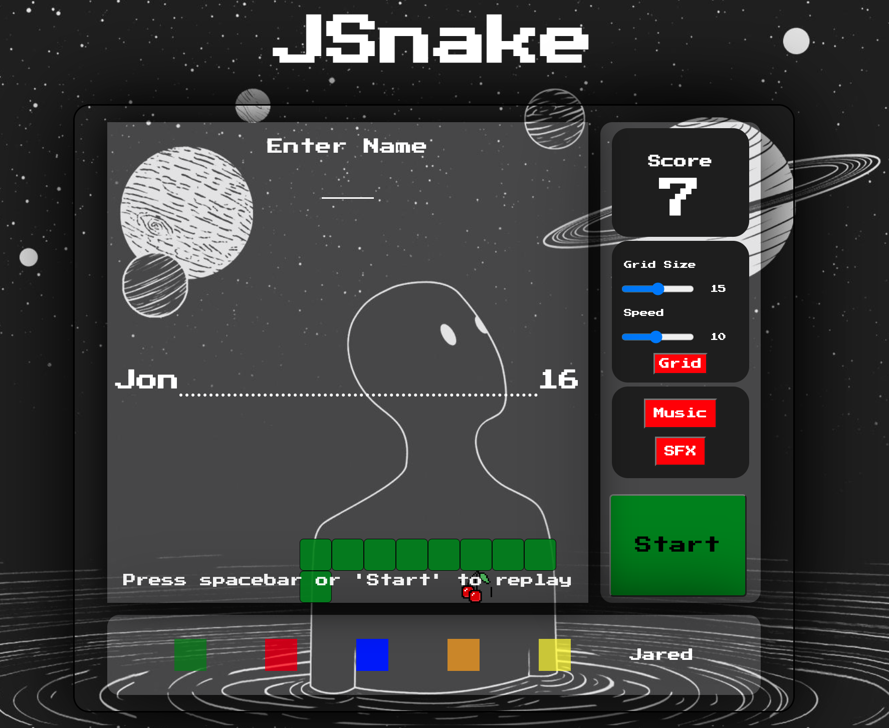

# JSnake

<h1>JSnake</h1>

Rendition of the classic 1997 Nokia grid-based game "Snake"

<h2>Features include:</h2>

 <ul>
    <li>Dynamic board sizing</li>
    <li>Variable speed control</li>
    <li>Changing snake colors</li>
    <li>Leaderboard to track your progress, or compete with your enemies</li>
 </ul>

Play [JSnake](https://cannatajon.github.io/JSnake/)
